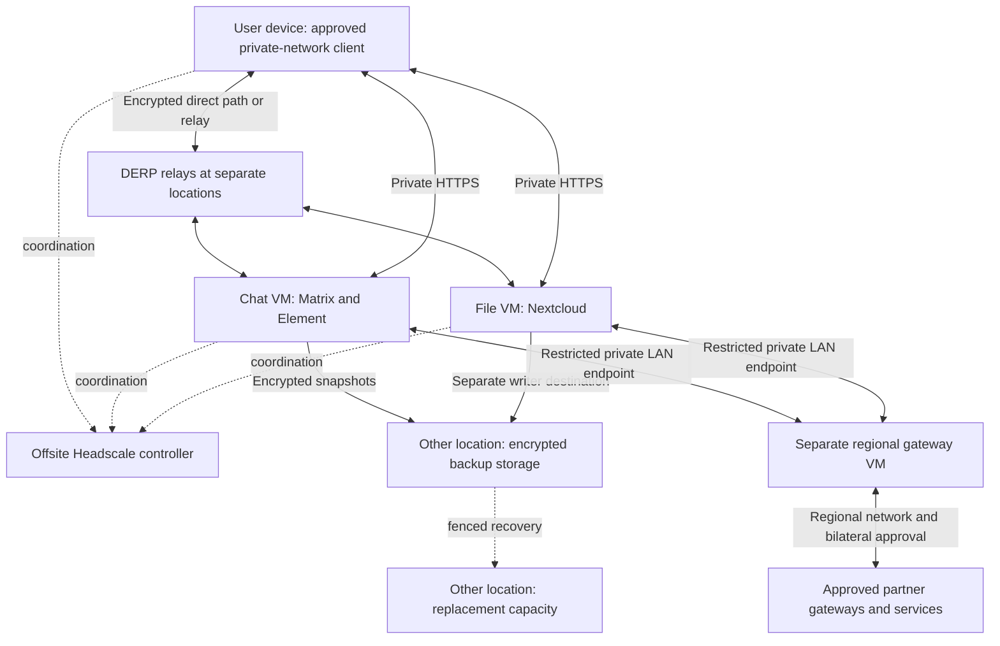

# Resilient Datacenter — experimental self-hosted services

Run your own private network, chat and files, keep an encrypted recovery copy elsewhere, and optionally exchange approved services with other organisations. This project provides a guided command-line installer and checked operating procedures for **fresh Ubuntu 24.04 amd64 machines with systemd**. Use existing VMs, physical machines or VPSs; no custom ISO or Proxmox requirement.

**Experimental, not a supported production release.** Real applications, separate networks, federation, encrypted recovery and selected upgrades have disposable Ubuntu acceptance evidence. Fresh Ubuntu guest installation and recovery behind simulated home NAT also pass; [see the measured boundaries](docs/home-nat-recovery.md). Physical sites, public certificate-provider issuance and an unfamiliar colleague's complete installation/recovery exercise still need acceptance. There is no automatic failover or promise of uninterrupted relocation.

## Choose your use

| Use | What you build |
|---|---|
| Personal | Offsite controller and relay, chat and/or files at home, encrypted storage and replacement capacity at another location |
| Institution | Your own network, Matrix with Element and Nextcloud on separate VMs, local accounts, certificates, backup and guided recovery |
| Regional partners | Each institution keeps its internal network; a separate gateway joins the regional network and carries only bilaterally approved application traffic |

The first resilience model is **one active service plus recoverable backup**. Federation exchanges permitted messages/files; it does not replicate an entire installation or migrate user accounts. Joining a network does not create an application account.

## Start here

Read the [machine and access checklist](docs/prerequisites.md). On your preparation computer, install Git and Python 3.11 or newer, then:

```sh
git clone https://github.com/kollanekirss/resilient-datacenter.git
cd resilient-datacenter
python3 -m venv .venv
.venv/bin/python -m pip install -r requirements.txt
./rdc start
```

Choose personal, institution or regional. The wizard asks questions and saves a private machine plan; it does not purchase or install servers. Continue with `./rdc guide /absolute/path/journey.json` using the path shown by the wizard. Follow the [step-by-step starting guide](docs/product-start.md) on the machine named by each task. A Mac can prepare configuration; server installation is blocked on unsupported systems.

Use a reviewed commit or [verified experimental release](docs/releases.md), and record `./rdc version`. Main is development source. The older 0.2.0-alpha.1 archive contains only the networking foundation; it cannot deploy the current product.

## How the roles connect



Keep controller and relay on separate machines in the tested baseline. Chat and files each use a separate enrolled VM. Each guided backup target accepts one writer, so multiple sources need separate target instances. A replacement must not run a copy of the active node's identity until the original is independently stopped or isolated.

The regional gateway has one regional network membership and a restricted LAN link to internal service VMs. Headscale controllers do not federate. Shared regional coordination remains a dependency, and each gateway is initially a single point of failure. [Infrastructure resilience](docs/infrastructure-resilience.md) explains additional relays and controller recovery.

## Install and operate

- [Guided networking and enrollment](docs/guided-setup.md), [commands and access approval](docs/operations.md)
- [Chat and Element](docs/matrix-services.md), [Nextcloud files](docs/nextcloud-services.md)
- [Encrypted backup, independent recovery credentials and fenced restoration](docs/backups.md)
- [Regional gateway and bilateral federation](docs/regional-gateway.md)
- [Controlled application upgrades](docs/upgrades.md), [certificate management](docs/managed-certificates.md)
- [Troubleshooting](docs/troubleshooting.md), [acceptance record](docs/validation-status.md), [site acceptance worksheet](docs/site-acceptance.md)

Run `sudo ./rdc status` on a managed server. Network, applications, certificates, backup age, recovery evidence and partners are reported separately. A running service is not proof of recovered user data. Complete each exercise with a real login and message/file operation.

Keep stable domain names, trusted certificates, independent administration access and recovery secrets outside the failed site. Backups briefly stop writers for consistency. Automatic pruning, immutable backup storage, external alert delivery, SSO, ARM support, built-in resilient DNS/Unbound, OPNsense configuration, office editing and general user-device fleet management are not included. DNS and provider access remain explicit prerequisites.

## Project and evidence

Consult [validation status](docs/validation-status.md) for exact runs and their limits. Historical results do not certify later source changes. The [product design](docs/superpowers/specs/2026-09-25-resilient-services-product-design.md) and [completion ledger](docs/superpowers/plans/2026-09-25-product-completion.md) define the scope and remaining work.

[Contribute](CONTRIBUTING.md), [report a vulnerability privately](SECURITY.md), or consult the [legacy four-VPS pilot](docs/legacy-pilot.md). Project code uses the [MIT license](LICENSE); upstream components retain their own licenses and notices.
