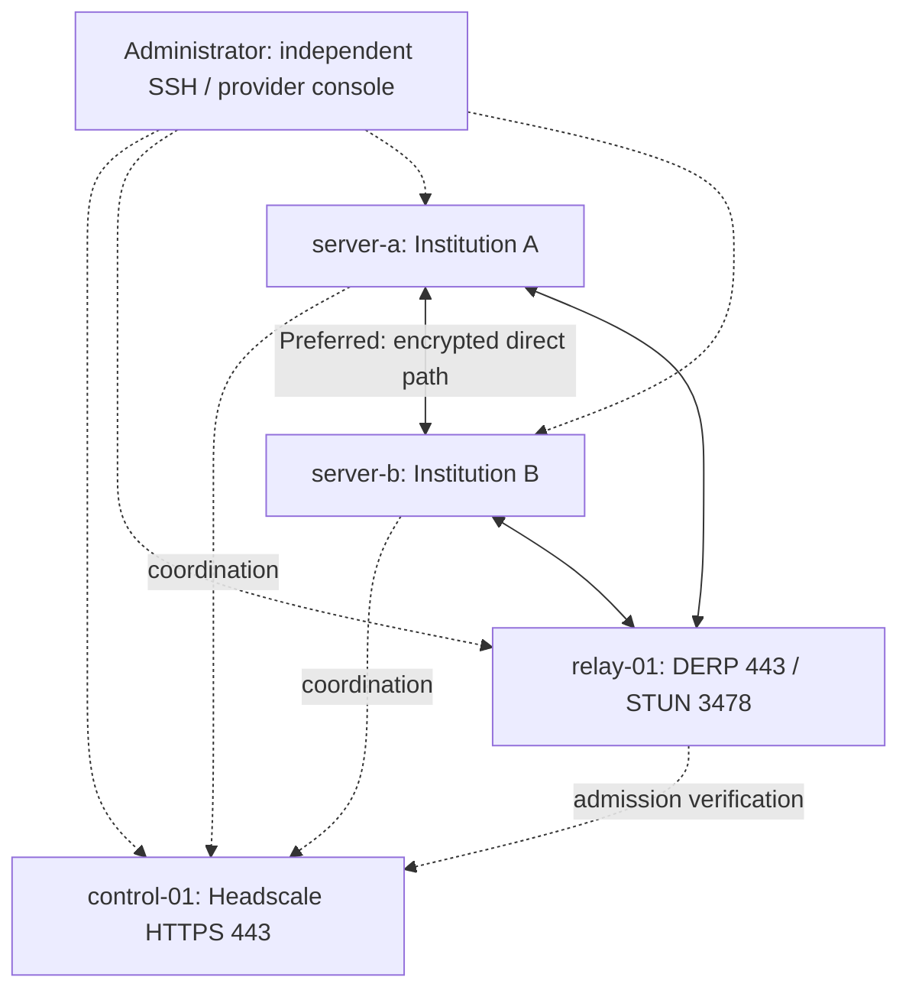

# Resilient Datacenter — experimental self-hosting kit

An Ansible connectivity kit for fresh **Ubuntu 24.04 LTS amd64** servers. It now includes two opt-in deployment profiles:

- **Independent:** your own Headscale controller, separate DERP relay and one or more client nodes.
- **Join:** your client nodes only, with explicit enrollment approval from an existing network administrator.

Start with the [common command interface](docs/operations.md) and [guided setup and local installation](docs/guided-setup.md) to answer questions and prepare an offsite network plus local-node manifests. The new local installer is designed for home/private-network Ubuntu machines without public management SSH; home NAT behaviour and the complete beginner journey still require acceptance testing.

See [verified experimental releases](docs/releases.md) for relay downloads with exact source and signed provenance. Downloading never installs or upgrades servers.

The [encrypted backup and recovery guide](docs/backups.md) covers owned network-service data, explicit fencing and guarded restore. The development source adds opt-in [Matrix/Element chat](docs/matrix-services.md) and [Nextcloud files](docs/nextcloud-services.md), each with application backup and recovery.

The [deployment-profile operator guide](docs/deployment-profiles.md) remains available for the existing SSH-managed workflows. Matrix/Element and Nextcloud have disposable Ubuntu application and recovery evidence. The experimental [regional gateway](docs/regional-gateway.md) has actual Matrix and Nextcloud federation and proxy/firewall evidence across independent test networks; gateway certificate renewal and encrypted recovery have disposable evidence. Gateway replacement bootstrap also has bounded disposable evidence. The guided product journey and separate operational status are available in development source; controlled application upgrades remain in progress. The guided workflow requires operator-supplied servers and DNS; it accepts supplied certificates or an explicit [managed certificate mode](docs/managed-certificates.md) for fresh infrastructure. Beginner usability has not been validated.

The original four-VPS pilot and its existing commands are retained below as the **legacy workflow**. Use one workflow consistently; neither path automatically migrates the other's installations.

**Status: experimental development.** Disposable Ubuntu runners have exercised actual network-service, Matrix and Nextcloud recovery; full multi-site deployments have not been accepted. No VPSs, DNS records or cloud resources have been created. This is the connectivity foundation, not a production autonomous data centre. Local validation cannot establish interoperability, failover or uninterrupted relocation; those require the live acceptance tests.

## Start here

Clone the project on your operator computer, then run the preparation wizard with Python 3.11 or newer:

```sh
git clone https://github.com/kollanekirss/resilient-datacenter.git
cd resilient-datacenter
python3 -m venv .venv
.venv/bin/python -m pip install -r requirements.txt
./rdc start
```

Run `./rdc` for the interactive menu, `./rdc doctor /absolute/path/node-NAME.yml` for diagnostics, and `./rdc version` for source identity. The GitHub Local checks workflow runs non-deployment checks on Ubuntu.

Choose **personal**, **institution** or **regional** to prepare a machine plan and checklist. Continue with `./rdc guide /absolute/path/journey.json`. The [product starting guide](docs/product-start.md) explains the full order and separate `./rdc status` evidence. Preparation does not install anything on servers. The original `./rdc setup` wizard remains available for independent or joining network configuration.

Follow the [guided setup instructions](docs/guided-setup.md) for the separate deployment, local installation and enrollment commands. Local installation supports **Ubuntu 24.04 amd64 with systemd**. Servers, DNS names, certificates and administrator approval are still required. The development checkout includes experimental Matrix/Element and Nextcloud packages on separate enrolled VMs. The published 0.2.0-alpha.1 archive predates them. Automatic failover is not available.

See [validation status](docs/validation-status.md) for completed local checks and unperformed live tests, and [contributing](CONTRIBUTING.md) to help improve the pilot. The project code is available under the [MIT license](LICENSE); third-party software keeps its own licenses.

## Connectivity overview



In the legacy pilot, only **TCP 8443 A→B and B→A** is granted between the two tagged servers. Other new inter-server application connections are denied by the supplied Headscale policy. The application endpoints bind only to their overlay IPv4 addresses. DERP carries encrypted traffic when a direct connection is unavailable; it does not replicate data or provide application failover.

## Legacy four-VPS workflow

1. Read [network prerequisites](docs/networking.md).
2. Prepare your local tools and build the relay artifact below.
3. Obtain the four VPSs, two public DNS names and appropriate TLS certificates.
4. Fill and validate your private inventory.
5. Run read-only preflight, then deploy.
6. [Enroll the two servers](docs/enrollment.md) through administrator approval.
7. Deploy test endpoints and run connectivity and isolation tests.
8. Work through [outage and recovery acceptance](docs/acceptance.md) before adding real institutional services.

The [detailed colleague plan](docs/colleague-project-plan.md) explains the wider project. The commands below describe the implemented kit and take precedence over illustrative paths or names in earlier planning documents.

## Local preparation — no VPS required

Use Python 3.11 or newer, OpenSSL and Go 1.21 or newer. Run these commands from this project directory. They create project-local dependencies and caches. Dependency downloads require internet access.

```sh
python3 -m venv .venv
.venv/bin/python -m pip install -r requirements.txt
.venv/bin/python scripts/check_local.py
.venv/bin/python scripts/build_derper.py
```

The relay helper selects **Go 1.26.6** and **tailscale.com v1.102.4**, cross-builds for Linux/amd64, and records the SHA256 in `artifacts/derper-build.json`. Module downloads use Go's checksum database; the resolved module checksums are retained in `artifacts/derper-go.sum`. It does not install Go or binaries globally. Keep the build metadata alongside an archived deployment release. Rebuilds after a toolchain or source change are a new release to test, not an automatic upgrade.

A relay artifact was already built in this working copy. It is ignored by Git; colleagues cloning this repository must build their own or receive a verified release artifact.

## Prepare deployment inputs

Suggested small lab starting point: 2 vCPU, 2 GB RAM and 20 GB disk per VPS, spread across at least two providers/locations. These are sizing assumptions for a connectivity pilot, not a production capacity recommendation.

```sh
mkdir -p inventories/lab
cp inventories/example/hosts.yml inventories/lab/hosts.yml
```

Edit only the private copy. Supply four distinct public IPv4 management addresses, SSH usernames, actual controller/relay DNS names, absolute local certificate/key paths, and the relay artifact path/checksum. Keep host names, group names, tags and peer pairings as supplied. Custom inventory plugins, arbitrary Ansible overrides and embedded credentials are intentionally outside this first version.

Certificates:

- Controller and relay: public-CA certificates with matching DNS SANs and full intermediate chains. Their names must resolve before deployment.
- Test endpoints: SANs matching `test_dns_name`; an institutional test CA is acceptable. Supply its PEM trust bundle as `test_ca_certificate`. Public DNS records for these endpoint names are unnecessary for the tests, which explicitly resolve them to discovered overlay addresses.
- Keys: unencrypted PEM, stored outside source control. The validator checks certificate dates, SANs and key matching; it also checks test endpoint chains against the supplied trust bundle. Public trust and reachability for controller/relay must be verified live.
- Renewal: your institution must issue/renew these certificates. Update the local files and redeploy the affected stage before expiry. This kit does not automate issuance or renewal.

Use an SSH agent or your SSH configuration for management keys; retain host-key verification. Confirm host keys through provider console or another trusted channel before Ansible. Sudo access is required; add `--ask-become-pass` if your institution requires an interactive sudo password.

```sh
.venv/bin/python scripts/validate_inventory.py inventories/lab/hosts.yml
.venv/bin/ansible-playbook -i inventories/lab/hosts.yml playbooks/preflight.yml
```

Preflight validates local inputs and reads target state without installing services. It rejects unsupported operating systems, unowned existing installations and a running managed client using another controller. Use fresh VPSs; this is not a migration tool. Ordinary check mode cannot simulate a fresh installation end to end because target binaries do not yet exist. `--syntax-check` is an offline syntax check only.

## Deploy and enroll

```sh
.venv/bin/ansible-playbook -i inventories/lab/hosts.yml playbooks/deploy.yml
```

Deployment preserves `/var/lib/headscale`, `/var/lib/sc-derp` and `/var/lib/tailscale`. It does not register or reset nodes. Review [enrollment](docs/enrollment.md), register each node, then run:

```sh
.venv/bin/ansible-playbook -i inventories/lab/hosts.yml playbooks/test-services.yml
.venv/bin/ansible-playbook -i inventories/lab/hosts.yml playbooks/verify.yml
.venv/bin/ansible-playbook -i inventories/lab/hosts.yml playbooks/verify-deny.yml
```

Run the full inventory without `--limit` or `--tags`; this small pilot expects all four hosts and both peers. Positive verification checks real HTTPS responses, certificate trust, hostname and server identity in both directions. Diagnostic `tailscale ping` output is separate: it does not prove application-policy access. Denial verification temporarily starts port 8444, confirms its local HTTPS response, confirms local SSH on port 22, then tests both remote ports. A refused connection is inconclusive and fails the check. Cleanup runs after failures; the temporary service also expires after 120 seconds.

Successful live checks write separate per-server JSON reports under `artifacts/`. A failed run does not constitute acceptance; use command exit status and fresh report timestamps, not an old file. Denied-port results must be checked against host/provider firewall rules before attributing the result specifically to Headscale policy.

## What is deliberately still pending

- Real multi-site and home-NAT deployments, disconnected-operation acceptance and colleague usability. Disposable runtime tests are recorded in the validation guide.
- Multiple controllers/relays, resilient bootstrap DNS, identity-service recovery and institutional trust governance.
- Regional application federation, resilient DNS, optional institutional SSO and integration guidance for existing routers such as OPNsense.
- A supported client-device installer and fleet lifecycle management.
- Production security review, external monitoring/alerts, physical offsite acceptance, controlled application upgrades and measured availability commitments.

There is one controller and one relay. The relay checks new client admission against the controller and fails closed. Existing direct sessions may continue during controller loss, but new enrollment, policy distribution and fresh relay admission are affected. There is no claim of high availability or disruption-free relocation. Tagged machine identities require explicit revocation and lifecycle management; the configured default expiry for untagged nodes does not imply tagged servers expire automatically.

See [validation status](docs/validation-status.md), [acceptance](docs/acceptance.md), [recovery](docs/recovery.md), and [version provenance](docs/provenance.md).
