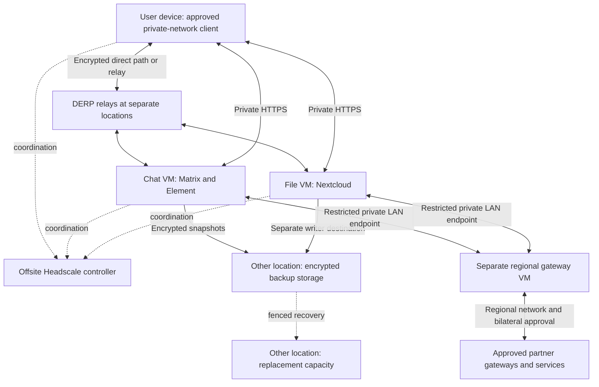

# Resilient Datacenter — toward portable crisis infrastructure

Run your own private network, chat and files, keep an encrypted recovery copy elsewhere, and optionally exchange approved services with other organisations. This project provides a guided command-line installer and checked operating procedures for **fresh Ubuntu 24.04 amd64 machines with systemd**. Use existing VMs, physical machines or VPSs; no custom ISO or Proxmox requirement.

**Experimental, not a supported production release.** Real applications, separate networks, federation, encrypted recovery and selected upgrades have disposable Ubuntu acceptance evidence. Fresh Ubuntu guest installation and recovery behind simulated home NAT also pass; [see the measured boundaries](docs/home-nat-recovery.md). Physical sites, public certificate-provider issuance and an unfamiliar colleague's complete installation/recovery exercise still need acceptance. There is no automatic failover or promise of uninterrupted relocation.

Current development iteration: [0.4.0-dev.3 — portable local applications](docs/release-notes/0.4.0-dev.3.md).

## The purpose: take essential services with you

An institution should be able to operate essential chat, files and recovery tools away from its main datacenter, including at a temporary crisis headquarters. The intended destination is a small, transportable system that works on its own local network, reaches other domestic sites when a route exists, and exchanges approved services with partners when connected. Moving a service box should not require a fixed public IP at its new location.

**The current release is a foundation for this goal, not a complete offline crisis appliance.** It provides private networking, applications, encrypted backups and controlled partner connections. The development portable profile now supplies local DNS/time preparation and separate NGINX/chat/files deployment without an overlay for local access. A complete offline installation/recovery kit and physical deployment acceptance remain outstanding. The scenarios below distinguish available mechanisms from work still required. Moving a dependency to another provider is insufficient if both sites still need the same unavailable DNS, identity service, cable, power supply or recovery account.

## Examples: why an institution would use this

These are planning scenarios, not predictions about Estonia's infrastructure or claims of operational readiness for emergency services.

| Situation | Institutional benefit and intended operation | Current support and remaining work |
|---|---|---|
| International connectivity or sea cables are disrupted, but some domestic routes remain | A rescue coordination team uses domestic chat/files and reaches approved regional partners through in-country infrastructure. | Self-hosted Headscale and multiple DERP locations are available. Domestic routing, DNS, certificates, identity and cold-start operation must be independently provided and tested; physical location alone does not prove a domestic path. |
| A headquarters loses power or must be evacuated | Staff carry a prepared mini-PC, router, power kit and essential data to another building; the same application identities are retained. | Service nodes can sit behind NAT. Safe shutdown/startup, changed-uplink reconnection and actual hardware relocation need acceptance. Transport causes downtime unless separately engineered continuity exists. |
| A field headquarters has no usable upstream connection | People on its local Wi-Fi can sign in, exchange messages and use locally held files. Remote partners remain unavailable until a path returns. | The experimental [portable LAN profile](docs/portable-local-applications.md) provides local HTTPS and local accounts without an overlay. Prepare DNS, trust and time first; complete-kit and physical cold-start acceptance remain required. |
| The main datacenter or its disks are lost | A second site restores essential services from an encrypted copy, using credentials held outside the failed site. | Guided backup and fenced recovery exist. Recovery loses changes newer than the selected snapshot and takes time. Recovery with all downloads and external certificate issuance blocked remains to be built and demonstrated. |
| Two institutions need to cooperate during a crisis | Each keeps ownership of its accounts/data; approved rooms or files cross a restricted partner connection. | Matrix/Nextcloud federation through regional gateways is supported. This does not merge Headscale networks, duplicate every file, or provide a second writable copy of the same institution. |
| A household wants the same independence on a smaller scale | Home-hosted services have an encrypted offsite copy and replacement capacity elsewhere. | The personal setup supports this recovery model. Two VMs on the same home PC do not survive loss of that PC or house together. |

## Three operating modes to build toward

1. **Local island:** the box, router and prepared user devices work without WAN, external DNS, external sign-in or package downloads. Local operation must not depend on contacting regional Headscale first. The experimental portable profile implements this local application path; complete-kit acceptance remains outstanding.
2. **Domestic connection:** reachable in-country controllers and relays reconnect sites over surviving IP paths. Each institution retains its own control and recovery arrangements. This builds on the existing networking foundation; disconnected restart and bootstrap still need validation.
3. **Partner connection:** a separate, explicitly approved gateway exchanges supported application traffic. Losing that connection must leave local work usable. Federation is application-specific; arbitrary databases and concurrent writable clones are not automatically reconciled.

### Changing IP addresses still needs a way to find peers

A portable **service node** need not have a static public IP. Its private identity and service names can remain stable while its upstream address changes, provided it can reach the required coordination/relay infrastructure. The current controller/relay setup still expects public IPv4 endpoints, DNS names and trusted TLS. It does not yet implement discovery of an entirely moving infrastructure.

Headscale can distribute a custom DERP map, including configured IP addresses. This helps avoid some relay lookup dependencies, but clients must first reach their controller or possess usable prior configuration. A DERP IP list alone does not solve controller discovery, TLS trust, key expiry or a complete loss of routing. Headscale's [DERP documentation](https://headscale.net/stable/ref/derp/) describes the upstream mechanism; it is not a guarantee that every DNS dependency disappears.

Previously connected clients can retain useful state during a controller outage, but enrollment, key refresh and policy changes require coordination. Treat a cold boot, a new device and a changed uplink as separate tests; do not infer their success from one surviving session. See the upstream [coordination outage limitations](https://tailscale.com/docs/reference/coordination-server-down).

The proposed domestic design therefore needs several independently reachable rendezvous locations, pre-provisioned trust and an authenticated way to update bootstrap addresses without the failed public DNS path. Multiple DERPs provide relay alternatives; they do not make one Headscale controller highly available. If every known endpoint moves and no discovery channel survives, automatic remote reconnection cannot be promised. Local island operation is the fallback in that case.

## Modular portable deployment direction

The agreed reference deployment is **Proxmox on the physical host, with separate OPNsense, Unbound, NGINX, Synapse/Element, Nextcloud and partner-connector VMs**. Service guests retain their own operating systems; Proxmox does not replace Linux inside those VMs. Prepare services, accounts and certificates during normal operation so local use does not require outside services during a crisis.

This is an experimental development profile with guided installation stages. Read the [reference architecture](docs/architecture/portable-proxmox.md) and [delivery roadmap](docs/architecture/portable-proxmox-roadmap.md). A [validated site-plan preview](docs/portable-site-plan.md) is available with `./rdc portable preview examples/portable-site.json`. It changes no servers. An [experimental Proxmox adapter](docs/proxmox-provisioning.md) can check an API and explicitly allocate stopped, disconnected VM shells. The [guided installation wizard](docs/portable-installation-wizard.md) now prepares and uploads pinned OS media and manages isolated console installation. The [local network kit](docs/portable-local-network.md), available in wizard step 8, adds guided OPNsense policy/DHCP setup, static addressing, a separate DNS/time module and client checks. Wizard step 9 adds a [local application kit](docs/portable-local-applications.md), with separate NGINX, chat and files deployment commands. Live Proxmox/OPNsense deployment and combined physical-kit acceptance remain outstanding. The existing Ubuntu deployment remains available.

## Example hardware for a small institutional pilot

These are **planning examples, not measured user-capacity guarantees or a shopping list**. Reuse existing equipment first and size it against actual data, concurrent users and the recovery window. Application guests target fresh Ubuntu 24.04 amd64. The modular profile uses Proxmox and an OPNsense guest; the existing standalone Ubuntu deployment is also available.

| Item | Example starting point | Purpose and independence requirement |
|---|---|---|
| Portable service host | NUC-class x86-64 mini-PC, virtualization support, 32 GiB RAM and 1 TB SSD as an initial lab budget | Separate chat and file VMs, plus headroom for staging. Large datasets or other institutional tools need more capacity. One host is one failure domain. |
| Local network kit | Router/firewall, small Ethernet switch and Wi-Fi access point; optional second upstream | Keeps the local LAN available during relocation. The portable wizard generates guided OPNsense configuration and a separate local DNS/time module. Physical routing and power independence still need testing. |
| Power kit | UPS or battery supplying the host **and** router/switch/AP | Measure the whole kit's watts and actual runtime. Include conversion losses, battery ageing and safe shutdown; a second server on the same dead circuit does not help. |
| Recovery kit | Encrypted removable SSD, offline instructions and independently held recovery credentials | Intended to carry data plus verified installers/images/configuration. The current release does not assemble a complete offline kit. Include Matrix users' encryption recovery keys through an appropriate separate process. |
| Second physical location | Independent backup storage and capacity to run the essential workload | Survives loss of the first box or site. Current guided backup targets accept one writer each, so chat and files need separate target instances. |
| Domestic coordination and relays | Separate small Ubuntu machines/VMs; initially allow 2 vCPU, 2 GiB RAM and 20 GiB disk per controller/relay | Controller plus relays in different physical/power/network locations. Relay bandwidth matters. Current setup needs public IPv4/DNS/TLS; a portable host need not carry the only controller. |
| Partner gateway, if needed | Dedicated Ubuntu VM with the documented restricted service-LAN connection | Joins the regional network without exposing the institution's entire internal network. It currently remains a single point of failure. |

Reserve space for backup history and simultaneous original/restored data during recovery. Record actual building, power and upstream dependencies: different VM names or providers are not evidence of physical independence. Plan disk encryption and an offline unlocking procedure for portable hardware; this package does not provision host disk encryption.

## How an institution would set it up

1. **Select the essential workload.** Name the staff, rooms, documents and institutional tools needed during a crisis. Decide acceptable downtime and maximum lost work. Other tools require their own deployment, backup and recovery procedures; this package currently includes chat and files.
2. **Map dependencies and locations.** Choose the portable site, independent backup/replacement site and domestic controller/relay locations. Write down which DNS, power, upstream, time, sign-in and administrator access each requires. Remove circular dependencies, such as recovery credentials stored only in the failed Nextcloud.
3. **Prepare machines and identities while connected.** Create separate supported Ubuntu VMs, choose permanent application domains, arrange DNS/TLS and prepare user devices. Follow the [prerequisites](docs/prerequisites.md). Pre-enroll devices and establish application accounts; network membership alone is not application access.
4. **Choose the deployment profile.** For the portable kit, use `./rdc start --platform proxmox` and follow guest installation, local network setup and local applications. For the existing overlay deployment, use `./rdc start`, choose institution and follow `./rdc guide`. Test real logins, messages and file transfers before adding data.
5. **Prepare independent recovery.** Configure encrypted offsite backups and keep the credentials outside the primary site. Restore onto a disposable replacement, independently stop or isolate the original before reusing its identity, and measure recovery time and snapshot age. Follow the [backup procedure](docs/backups.md).
6. **Add partners deliberately.** Start with one partner and the [regional gateway procedure](docs/regional-gateway.md). Approve only the required application traffic. Test revocation and a lost regional connection. Keep local administration and accounts independent of the partnership.
7. **Validate the complete portable kit before relying on it.** Follow the [local application exercise](docs/portable-local-applications.md), then the full disconnected exercise below with disposable data and a colleague following the instructions. Offline empty-host recovery and portable partner reconnection remain separate development stages.

## Next milestone: prove a portable crisis box

The portable application implementation adds the local HTTPS path. The next engineering priorities are **complete offline reconstruction and domestic reconnection**, alongside real Proxmox/OPNsense and physical-kit acceptance. Additional applications should come after this foundation.

- Validate the implemented LAN HTTPS path on the complete kit with stable names, prepared trust and enforced source restrictions.
- Validate the implemented local DNS/time module together with client addressing and certificate lifecycle planning. Preserve authoritative local records and recovery instructions independently.
- Make local application accounts, emergency administration and prepared client trust usable without external identity providers. Define enrollment, expiry and revocation behaviour during a partition.
- Package verified OS/application dependencies, configuration, certificates, encrypted backups and instructions for recovery without GitHub, container registries or a public certificate issuer. Handle secrets separately from public release artifacts.
- Define controller recovery and authenticated bootstrap-address updates across independent domestic sites. Do not advertise active-active Headscale or transparent controller federation without a supported, tested design.
- Specify how each application handles disconnected work and reconnection. Two isolated writable copies of the same service are not a safe default; document authority, conflict handling and recovery ownership.

**Acceptance exercise:** prepare two sites; block external DNS and internet; power off and cold-start the portable kit; log in from prepared local devices; send a new message and upload/download a file; move the kit to a different LAN/uplink; reconnect over a surviving domestic path; exchange an approved message/file with a partner; finally restore a lost box from the offline kit with WAN still blocked. Also test expired credentials/certificates, a lost relay/controller and unavailable backup storage. Record which actions work, which require an operator, interruption length and lost changes. Until that passes, describe the release as an experimental foundation, not a ready crisis-response datacenter.

## Choose your use

| Use | What you build |
|---|---|
| Personal | Offsite controller and relay, chat and/or files at home, encrypted storage and replacement capacity at another location |
| Institution | Your own network, Matrix with Element and Nextcloud on separate VMs, local accounts, certificates, backup and guided recovery |
| Regional partners | Each institution keeps its internal network; a separate gateway joins the regional network and carries only bilaterally approved application traffic |

The first resilience model is **one active service plus recoverable backup**. Federation exchanges permitted messages/files; it does not replicate an entire installation or migrate user accounts. Joining a network does not create an application account.

## Start here

For the new modular Proxmox guest-installation journey, prepare the dependencies below and run `./rdc start --platform proxmox --output-dir /absolute/private/path/my-portable-site`. Follow the [wizard guide](docs/portable-installation-wizard.md). This development profile includes guided console installation, network preparation and a local application kit. Deployment commands run inside the intended separate guests; see the [local application guide](docs/portable-local-applications.md).


Read the [machine and access checklist](docs/prerequisites.md). On your preparation computer, install Git and Python 3.11 or newer, then:

```sh
git clone https://github.com/kollanekirss/resilient-datacenter.git
cd resilient-datacenter
python3 -m venv .venv
.venv/bin/python -m pip install -r requirements.txt
./rdc start
```

Choose personal, institution or regional. The wizard asks questions and saves a private machine plan; it does not purchase or install servers. Continue with `./rdc guide /absolute/path/journey.json` using the path shown by the wizard. Follow the [step-by-step starting guide](docs/product-start.md) on the machine named by each task. A Mac can prepare configuration; server installation is blocked on unsupported systems.

Use a reviewed commit or [verified experimental release](docs/releases.md), and record `./rdc version`. Main is development source. The older 0.2.0-alpha.1 archive contains only the networking foundation; it cannot deploy the current product.

## How the existing overlay roles connect



Keep controller and relay on separate machines in the tested baseline. Chat and files each use a separate enrolled VM. Each guided backup target accepts one writer, so multiple sources need separate target instances. A replacement must not run a copy of the active node's identity until the original is independently stopped or isolated.

The regional gateway has one regional network membership and a restricted LAN link to internal service VMs. Headscale controllers do not federate. Shared regional coordination remains a dependency, and each gateway is initially a single point of failure. [Infrastructure resilience](docs/infrastructure-resilience.md) explains additional relays and controller recovery.

## Install and operate

- [Guided networking and enrollment](docs/guided-setup.md), [commands and access approval](docs/operations.md)
- [Chat and Element](docs/matrix-services.md), [Nextcloud files](docs/nextcloud-services.md)
- [Encrypted backup, independent recovery credentials and fenced restoration](docs/backups.md)
- [Regional gateway and bilateral federation](docs/regional-gateway.md)
- [Controlled application upgrades](docs/upgrades.md), [certificate management](docs/managed-certificates.md)
- [Troubleshooting](docs/troubleshooting.md), [acceptance record](docs/validation-status.md), [site acceptance worksheet](docs/site-acceptance.md)

Run `sudo ./rdc status` on a managed server. Network, applications, certificates, backup age, recovery evidence and partners are reported separately. A running service is not proof of recovered user data. Complete each exercise with a real login and message/file operation.

Keep stable domain names, trusted certificates, independent administration access and recovery secrets outside the failed site. Backups briefly stop writers for consistency. Automatic pruning, immutable backup storage, external alert delivery, SSO, ARM support, built-in resilient DNS/Unbound, OPNsense configuration, office editing and general user-device fleet management are not included. DNS and provider access remain explicit prerequisites.

## Project and evidence

Consult [validation status](docs/validation-status.md) for exact runs and their limits. Historical results do not certify later source changes. The [product design](docs/superpowers/specs/2026-09-25-resilient-services-product-design.md) and [completion ledger](docs/superpowers/plans/2026-09-25-product-completion.md) record the earlier release scope and remaining work. The portable crisis requirements above extend that scope and are not completed by the existing release evidence.

[Contribute](CONTRIBUTING.md), [report a vulnerability privately](SECURITY.md), or consult the [legacy four-VPS pilot](docs/legacy-pilot.md). Project code uses the [MIT license](LICENSE); upstream components retain their own licenses and notices.
