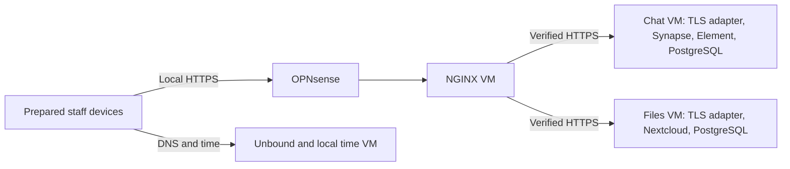

# Portable local chat, files and HTTPS

The development installer adds an explicit **portable LAN** profile for the
separate-VM architecture. It is experimental. It does not require Headscale or
Tailscale for local application installation, startup or application restoration.
Existing enrolled overlay installations retain their original defaults.

The path is:



NGINX and both applications keep fixed **private site addresses** while the
external uplink can change. No fixed public IP is needed for this local path.
Keep the internal subnets, service names, credentials and application identity
unchanged during relocation. This does not promise remote reachability when
routes, coordination or bootstrap discovery are unavailable.

## Before deployment

Complete [guest installation](portable-installation-wizard.md) and the
[local network kit](portable-local-network.md). The current OPNsense activation
remains guided console configuration. The installer does not change Proxmox host
bridges or discover whether the physical recovery site is independent.

Use dedicated Ubuntu 24.04 amd64 guests with systemd. Starting planning sizes are
4 GiB RAM each for chat and files and 1 GiB for NGINX, with at least 12 GiB free on
each application VM before installation and additional space for actual files,
database growth and recovery candidates. These are minimum installation checks,
not measured concurrent-user capacity. The full kit also needs the edge, DNS,
hypervisor, local switch/AP and independent power and backup capacity.

Copy the reviewed project version and install its documented Python dependencies
while connected. Backend installation obtains the pinned application images and
required Ubuntu packages when they are absent. It is a **pre-crisis preparation**
operation; a complete offline software bundle is a later stage. Boot and local
user operations use already installed software.

Choose real institution-controlled service domains. Prepare client trust, local
accounts and recovery access beforehand. A private CA is possible if that CA is
already trusted by every intended client and server. The installer does not
silently add new trust roots. Certificates must remain valid for the planned
offline duration plus margin, and the local clock must have correct UTC.

## Prepare a reviewable kit

Use wizard step **9 — Local applications**, after step 8 has saved network
settings, or run:

```sh
./rdc portable applications-prepare /private/site.json \
  --settings /private/network.json --output-dir /private/application-kit
./rdc portable applications-verify /private/site.json \
  --settings /private/network.json --output-dir /private/application-kit
```

The destination parent must be private and owned by you (mode 0700). Preparation
never contacts a server. It produces the site/network records, chat and file
profiles, frontend settings, rendered NGINX configuration, an integrity manifest
and a site-specific `START-HERE.md`. It includes no private keys or passwords.
Verification checks both hashes and exact regeneration from the reviewed inputs;
it does not certify deployment health. Existing output is never overwritten.

The generated profiles use the site identifier as the institution identifier and
`chat`/`files` as node names. A plan fingerprint and exact frontend/backend
addresses bind the installation. Altered inputs are not treated as a harmless
retry: address/identity changes require a separately reviewed migration.

## Install the application VMs

On the **chat VM**, place a trusted certificate chain naming both the Matrix and
Element domains at `/etc/rdc-prepared/chat.crt`, and its root-owned mode-0600 key
at `/etc/rdc-prepared/chat.key`:

```sh
sudo ./rdc portable applications-apply /private/application-kit/site.json --role chat
sudo ./rdc services account --admin
sudo ./rdc services account
```

The account commands create local application accounts and prompt privately for
passwords. They do not depend on external SSO. Prepare any browser/device
verification and encrypted-chat recovery keys while the kit is available.

On the separate **files VM**, prepare the Nextcloud domain's chain/key at
`/etc/rdc-prepared/files.crt` and `/etc/rdc-prepared/files.key`:

```sh
sudo ./rdc portable applications-apply /private/application-kit/site.json --role files
sudo ./rdc files account
```

The initial installation requests the Nextcloud administrator name and password.
Run these commands only on their intended VM. The installer verifies the active
local address, DNS, certificate material and owned resources. An interrupted
installation can be retried with the identical plan; it cannot adopt another
network identity or overwrite unrelated applications.

## Install NGINX on its own VM

Prepare Ubuntu's `nginx` and `nftables` packages, then disable and stop the stock
`nginx.service` on this dedicated VM. The project installs a separate
`rdc-frontend.service`; it does not replace stock NGINX configuration. Existing
websites, conflicting listeners or unexpected unit overrides require review.

In a private TLS directory prepare these root-owned files:

| Files | Certificate identity |
|---|---|
| `chat.crt`, `chat.key` | Permanent Matrix hostname |
| `element.crt`, `element.key` | Permanent Element hostname |
| `files.crt`, `files.key` | Permanent Nextcloud hostname |
| `backend-ca.crt` | Approved CA certificate bundle for the backend HTTPS identities |

All keys must have mode 0600. Prefer different keys for frontend and backend
certificates. Use the generated OPNsense instructions to permit **only NGINX's
address → each application address, TCP 443**, without NAT. Preserve source
addresses; source NAT would break the backend restriction. Do not add WAN ingress
or expose application HTTP/database ports.

```sh
sudo ./rdc portable frontend-apply /private/application-kit/site.json \
  --settings /private/application-kit/network.json --tls-dir /private/frontend-tls
```

NGINX resolves no external backend names at runtime: it connects to literal site
addresses and verifies the permanent hostname and its certificate against the
prepared trust bundle. It replaces forwarding headers, rejects unknown names or
mismatched SNI/Host and keeps its own firewall. Backends accept application HTTPS
only from the frontend or local health checks. Databases and application HTTP
listeners remain on loopback. Element assets are hosted locally.

An unavailable backend does not stop NGINX serving other applications. Frontend
installation verifies TLS listeners, **not user login or the health of every
backend**. Service installation similarly reports listener checks separately
from actual user-operation evidence.

## Prove the local operating mode

Use a prepared staff client to sign in, send/read a chat message, and upload and
download a file. Test both applications. Then disconnect WAN and partner paths,
cold-restart the guests and repeat. Check the clock, certificate expiry and local
DNS; cached browser pages or a surviving session are not enough.

Check direct backend access from staff and another application-zone device is
denied. Stop the files VM and confirm chat still works. Record the exact software
versions, user actions, elapsed restart/recovery time and any lost changes. Test
unfamiliar staff operating from the printed instructions before relying on it.

## Back up, restore and maintain

The existing backup wizard accepts source role **portable**. Set institution to
the saved site name and source node to `chat` or `files`. Configure an independent
SFTP destination using the [backup contract](backups.md), include services,
take snapshots and exercise explicitly fenced restoration. The fixed transport
uses SSH user `rdc-backup` and repository `/data/INSTITUTION-NODE` as seen inside
SFTP. Verify its Ed25519 host key independently and restrict the writer account.
The existing project storage-target installer still uses overlay access; this
profile needs a separately prepared institutional SFTP destination reachable on
its local/private network.

Portable snapshots include the selected access identity, application accounts,
database, data and exact supported configuration. Restore isolation blocks LAN
application ingress during validation; it does not wait for Tailscale. Controlled
upgrade ownership also preserves the same access identity. Changed site/address
identities cannot be slipped into an upgrade or restored snapshot.

**Snapshots do not reconstruct the full appliance.** Save encrypted copies of
frontend/backend TLS material, CA trust, site settings, edge/DNS configuration,
software artifacts and recovery credentials independently. Full empty-host
rebuild without downloads remains a separate roadmap stage. Fence the old
application before promoting a restored identity; never run two writable copies.
Matrix users also need their own encryption recovery material.

Renew frontend certificates with `frontend-renew` and the same plan/settings plus
a private directory containing the replacement TLS set. Activation retains the
previous generation and attempts rollback if restart fails. Backend certificate
replacement remains `services certificate` / `files certificate`. Rehearse
renewal and recheck coverage before the offline period; boot does not issue new
public certificates.

Regional federation is blocked for this new profile pending the separate
relocation/partner-path phase. The existing overlay profile's approved regional
connectors remain available. This release adds local independence, not automatic
multi-site failover, active-active storage or Headscale federation.

## Evidence boundary

The new hosted workflow tests each actual application with a real NGINX frontend
in a separate network namespace, a staff client and an attacker on the backend
bridge. It exercises certificate/header/source restrictions, external-network
blocking, service cold restart and native application snapshot restoration.
Both packages passed [run 36195561861](https://github.com/kollanekirss/resilient-datacenter/actions/runs/36195561861); see the [release evidence](release-notes/0.4.0-dev.3.md). These component
exercises do not substitute for a full Proxmox/OPNsense installation, combined
physical-kit boot, relocation, power-runtime measurement or independent operator
acceptance. No server software is executed on the preparation Mac.
