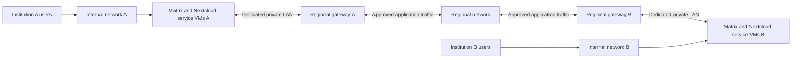

# Experimental regional gateway

This is a development milestone, not the completed regional service package. Matrix and Nextcloud exchange across real independent Headscale networks, transport restrictions and interrupted policy changes have disposable Ubuntu evidence. Gateway certificate renewal and gateway recovery remain in progress. Use disposable infrastructure for this path until the remaining checks pass.

## What the gateway connects

Each institution keeps its own internal Headscale controller, users and service nodes. A separate Ubuntu 24.04 amd64 gateway joins the regional controller once. It reaches its institution's service VMs through a dedicated private LAN. It never advertises that LAN as a subnet or acts as an exit node.



The gateway has one regional VPN identity. Service VMs keep their internal identities. The regional operator controls network admission; each institution controls its local signed partnership approvals and application accounts. Network source-address filtering relies on the regional controller's integrity. Application authentication and document/room permissions remain necessary. The gateway is currently a single failure point; a regional failure does not by itself move users or replicate their data.

## Prepare a disposable gateway

1. Create a dedicated supported Ubuntu VM. Give it internet access for outbound enrollment and a separate private LAN interface. Use a dedicated trusted VLAN or virtual switch; this is not a shared guest Wi-Fi segment.
2. Use the existing local node installation/enrollment flow to join the regional controller. Record its assigned regional IPv4. Do not join this same client to the institution's internal controller.
3. Assign distinct RFC1918 addresses to the gateway and service VMs on one dedicated /24 through /30 subnet. The installer verifies the gateway interface; it does not create the switch, VLAN or service interfaces for you. Service VMs need their own normal connectivity as well.
4. Follow [bilateral approvals](regional-approvals.md) to create the institution identity and independently confirm partner fingerprints. Keep the encrypted signing key on the administrator's machine. Copy only its public identity and completed signed agreements to the gateway.
5. Supply a system-trusted PEM certificate and private key naming the declared service domains. Keep the key root-readable only. Certificates must have at least seven days remaining. The optional gateway issuer below can supply these files and renew them; live provider acceptance is still required.
6. Prepare the profile interactively, review it, then check the dedicated gateway. Paths below are examples; replace them with the files you prepared.

```sh
./rdc gateway setup --identity /home/operator/institution-public.json --output-file inventories/lab/gateway.json
sudo ./rdc gateway check inventories/lab/gateway.json
sudo ./rdc gateway apply inventories/lab/gateway.json
```

The profile asks for private LAN addresses and certificate paths. Identity, regional controller and service domains come from the signed public identity. Installation adds a pinned Envoy container, a fixed systemd runtime, an owned firewall table and a setting disabling general forwarding. It refuses another node's configuration and existing unowned containers/listeners. It starts with no approved partners.

## Apply a reviewed partnership

```sh
sudo ./rdc gateway policy --agreement /root/partner-one-approved.json --agreement /root/partner-two-approved.json
sudo ./rdc gateway status
```

The policy command replaces the selected set of agreement documents; an empty selection closes all peer access. At most eight peer documents are supported initially. Both parties' signatures and exact pinned local identity must match. Agreements that are expired, not yet active or locally revoked produce no access. Matrix and Nextcloud transport are enabled only for the services named in each current bilateral agreement.

The gateway exposes Matrix federation/key endpoints over regional HTTPS. It blocks Matrix client/admin routes. Its LAN-only CONNECT proxy accepts the Matrix service's fixed source address and only the selected partner Matrix hostnames on port 443. It cannot be used as a general web proxy. The upstream service endpoint uses verified HTTPS on its dedicated LAN address, port 8443; configure it with the service attachment instructions below.

A successful gateway policy command proves local policy activation, not a successful federated chat or file operation. Status deliberately reports application federation as unverified.

## Revoke or resume

```sh
sudo ./rdc gateway revoke AGREEMENT_ID
sudo ./rdc gateway resume
```

`revoke` closes this gateway's future traffic for the agreement and keeps its identifier in durable revocation history. Re-importing the same agreement cannot remove that revocation. Also record the revocation in the administrator workspace. Neither action retracts data already delivered to a partner.

Policy changes journal their intent before activation and close traffic before replacing configuration. An activation failure leaves the pending transition in place and attempts to verify closure. A restart with that pending transition stays closed. Use `resume` after correcting the reported cause; it retries the exact pending change. If the command says closure could not be verified, isolate the gateway before retrying. It never reopens an earlier policy merely to undo a failed revocation.

Do not treat an ordinary network-only backup as a gateway backup. Extend its scope explicitly with `backup include-services`. The [gateway recovery procedure](backups.md#regional-gateway-recovery-development) preserves validated issuer recovery material outside the proxy and requires fresh partner approval after restoration. Encrypted recovery and clean replacement bootstrap have disposable evidence, including a failed-restore rollback. Gateway lifecycle uses a synthetic VPN fixture; actual client identity relocation is tested separately. Keep the institution approval signing key independently recoverable and off the gateway.

## Evidence

- [Proxy/firewall boundary run](https://github.com/kollanekirss/resilient-datacenter/actions/runs/36140820264): approved and denied routes, fixed destinations, expiry and revocation stopping existing streams in both directions.
- [Gateway lifecycle run](https://github.com/kollanekirss/resilient-datacenter/actions/runs/36141569056): actual installation, frozen runtime, repeated installation, systemd restart, interrupted revocation, closed restart, explicit resume and replay denial.

Both use explicit synthetic network fixtures. They are not evidence of home NAT traversal, real cross-controller membership or application federation.

## Attach the Matrix service VM (development)

On the gateway, export a public service-link document for the selected, currently approved Matrix agreements:

```sh
sudo ./rdc gateway service-link --output-file /root/matrix-service-link.json
```

Copy that public file through your normal administrator channel to the institution's Matrix VM. Do not copy the approval signing key or gateway private certificate key. The service VM must still belong to the separate internal network and must have the declared dedicated private LAN address. On that VM:

```sh
sudo ./rdc services regional attach /root/matrix-service-link.json
sudo ./rdc services regional status
```

At first attachment, independently confirm the full institution signing fingerprint from the administrator workspace. Review the LAN addresses and partner names. Attachment briefly restarts chat and its proxy. It adds only the fixed LAN federation/key routes on HTTPS 8443 and the restricted outbound gateway proxy; ordinary users keep the existing internal HTTPS service. Older experimental runtime files need a reviewed upgrade first and are not silently replaced by attachment.

`sudo ./rdc services regional disable` removes the active connector from the running service configuration. Restoring application data also suspends the connector persistently; re-export and review current agreements before reattaching it. Application backup protects chat data and identity, not an automatic restoration of old partner admission.

The attach operation's success reports configuration/readiness only. Send and read a real partner-room message before recording successful federation. The [Matrix connector and recovery run](https://github.com/kollanekirss/resilient-datacenter/actions/runs/36144496260) passed actual LAN source/path restrictions, connector installation and persistent suspension after application restoration. The [independent network run](https://github.com/kollanekirss/resilient-datacenter/actions/runs/36143267057) passed real separate memberships. The subsequent [actual regional Matrix run](https://github.com/kollanekirss/resilient-datacenter/actions/runs/36145734658) passed room exchange in both directions, denial of unapproved access, blocked later delivery after revocation, and internal chat after regional shutdown. This is disposable API-level acceptance; physical sites and encrypted cross-institution browser acceptance remain separate.

## Connect the file service

After installing the independent Nextcloud package and applying current bilateral approvals on the dedicated gateway, export its public connector document:

```sh
sudo ./rdc gateway service-link --package nextcloud --output-file /root/nextcloud-link.json
```

Copy that public document to the institution's Nextcloud VM. Assign the declared private LAN address to that VM, then attach it:

```sh
sudo ./rdc files regional attach /root/nextcloud-link.json
sudo ./rdc files regional status
```

The initial attachment asks you to confirm the institution's full approval fingerprint independently. It briefly restarts the application and HTTPS proxy. Users share with a partner's full account address and the recipient explicitly accepts the share. Public links, group federation and automatic acceptance remain disabled. A gateway approval enables transport; it does not give a partner access to every file.

To suspend the local connector, use `sudo ./rdc files regional disable`. A restored file service stays suspended until current partner approvals are reviewed and attached again. Gateway revocation blocks future delivery but cannot remove copies already downloaded by a recipient.

The current source passed disposable file exchange and destination-denial checks in run36151160141. This does not establish unattended gateway renewal, gateway disaster recovery or physical-site acceptance.

## Replace the gateway certificate

The development source now includes manual managed replacement; its native acceptance is recorded separately in `validation-status.md`. The optional issuer below uses the same activation transaction.

```sh
sudo ./rdc gateway certificate status
sudo ./rdc gateway certificate replace --certificate /root/renewed.crt --private-key /root/renewed.key
```

The certificate must name every service in the signed gateway identity and chain to a system-trusted authority. Replacement briefly closes partner transport, checks the new certificate actually served by the proxy, and recovers the previous certificate if activation fails. A dedicated check listener binds only to localhost and denies all HTTP requests. If the operation is interrupted, partner transport stays closed; repeat the replacement with the same certificate/key files to complete it. Resolve a pending partner-policy change before starting a separate certificate change. The development format is not an automatic upgrade of previously installed experimental gateway revisions.

## Prepare automatic gateway renewal

The optional issuer uses a restricted Cloudflare DNS token and the fixed Let's Encrypt production endpoint. Its provider boundary is simulated in automated tests; verify actual domain issuance on your infrastructure before relying on it.

On the dedicated, enrolled gateway, use your own signed public institution identity:

```sh
./rdc gateway issuer setup --identity /root/own-identity.json --output-file /root/gateway-issuer.json
sudo ./rdc gateway issuer issue /root/gateway-issuer.json
```

The wizard derives the service domains from that identity and asks for the certificate account email and explicit issuer-terms consent. Issuance prompts privately for the restricted DNS token. Use the printed certificate/key paths when preparing the gateway installation. After installing the gateway:

```sh
sudo ./rdc gateway issuer enable
sudo ./rdc gateway issuer status
```

Enabling checks the installed gateway fingerprint and exact service domains. The twice-daily scheduler checks for renewal, validates the issued material and activates it through the same closed, verified transaction. Provider failure retains the currently active certificate and records failure. Keep emergency DNS-provider and recovery access separately. The existing `rdc-service-certificate` scheduler names are shared implementation names; each dedicated node owns only its own issuer configuration.
